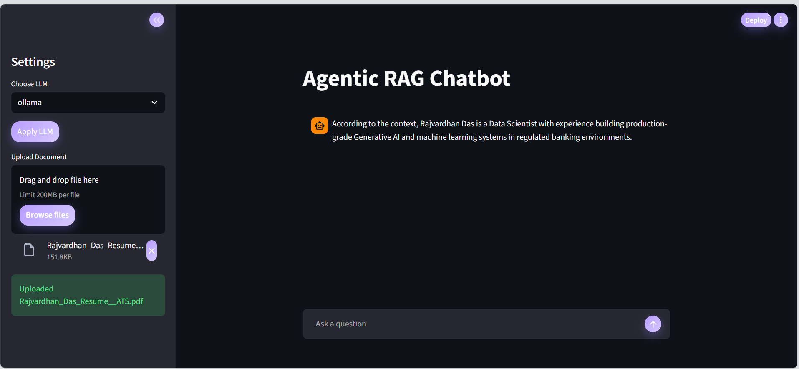

<<<<<<< HEAD
# Agentic RAG Chatbot 🚀

RAG | MCP | Milvus | Self-Hosted LLM | Streamlit | Multi Agent | Error Handling | FastAPI | Gemini

A full-stack **Agentic Retrieval-Augmented Generation (RAG)** system built with a modular, production-oriented architecture.  
The system supports **hybrid retrieval**, **self-hosted LLMs**, **Milvus vector database** and **MCP-style tool servers**.

---

## ✨ Key Features

- 🧠 **Agentic Architecture**
  - Planner Agent
  - Retriever Agent (Hybrid Retrieval)
  - Context Builder Agent
  - Answer Agent
  - Orchestrator

- 🔍 **Advanced Retrieval Techniques**
  - Dense vector retrieval (embeddings)
  - Keyword-based lexical search
  - Hybrid fusion (dense + keyword)
  - Embedding-based reranking

- 🗄️ **Vector Database**
  - Milvus (Docker-based)
  - Swappable vectorstore design

- 🤖 **LLM Support**
  - Primary: **Ollama (LLaMA 3)**
  - Secondary: **Gemini API**
  - Runtime LLM switching from frontend

- 🔌 **MCP (Model Context Protocol) Server**
  - Exposes ingestion and query as callable tools
  - Designed for agent-to-agent or tool-based invocation

- 🌐 **FastAPI Backend**
  - File upload & ingestion
  - Chat endpoint
  - LLM selection endpoint

- 🎨 **Streamlit Frontend**
  - Theme with lavender accents
  - Glassmorphism (blurred panels)
  - Animated chat messages
  - Rounded, modern UI

- 🛡️ **Comprehensive Error Handling**
  - Centralized custom exceptions
  - Structured logging
  - Graceful API failures

---

## ➕ Extra Implementation: Hybrid Runtime LLM Switching

The system supports **runtime switching between multiple LLM providers** without restarting the application.

Currently supported:

- Ollama (self-hosted LLaMA 3)
- Gemini API

Users can select the desired LLM directly from the frontend UI, and the backend dynamically routes all generation requests to the chosen provider.

This enables:

- Easy benchmarking across models  
- Cost vs quality trade-offs  
- Fault tolerance (fallback to alternate LLM)  
- True provider-agnostic architecture  

Implementation details:

- Centralized LLM router (`services/llm.py`)
- Active provider stored in configuration
- FastAPI endpoint: `/set-llm`
- Frontend dropdown for live switching

This hybrid LLM routing layer is implemented in addition to the assignment requirements.

---


## 🖼️ Sample Screenshot

Below is an example interaction with the Agentic RAG Chatbot showing document-grounded answering:




> Additional UI and system screenshots are provided in the accompanying PDF document.


---

## 🏗️ System Architecture

Streamlit UI
↓
FastAPI Backend
↓
Orchestrator Agent
├── Planner Agent
├── Retriever Agent
│ ├── Dense Search
│ ├── Keyword Search
│ └── Reranker
├── Context Builder
└── Answer Agent
↓
LLM (Ollama / Gemini)
↓
Milvus Vector DB


---

## 📁 Project Structure


Agentic-RAG-Rajvardhan/
├── backend/
│ ├── agents/
│ │ ├── planner.py
│ │ ├── retriever.py
│ │ ├── context_builder.py
│ │ ├── answer_agent.py
│ │ └── orchestrator.py
│ ├── ingest/
│ │ ├── loader.py
│ │ ├── cleaner.py
│ │ ├── chunker.py
│ │ └── pipeline.py
│ ├── services/
│ │ ├── llm.py
│ │ ├── embeddings.py
│ │ ├── reranker.py
│ │ └── keyword_search.py
│ ├── vectorstore/
│ │ └── db.py
│ ├── exceptions/
│ │ ├── exceptions.py
│ │ └── logger.py
│ ├── app.py
│ └── mcp_server.py
├── frontend/
│ └── streamlit_app.py
├── data/
│ └── sample_docs/
├── requirements.txt
└── README.md


---

## ⚙️ Setup Instructions

### 1️⃣ Clone Repository & Create Virtual Environment

```bash
python -m venv venv
venv\Scripts\activate   # Windows

2️⃣ Install Dependencies
pip install -r requirements.txt

3️⃣ Start Milvus (Docker)
cd C:\milvus

Invoke-WebRequest https://raw.githubusercontent.com/milvus-io/milvus/refs/heads/master/scripts/standalone_embed.bat -OutFile standalone.bat

standalone.bat start


Verify:

docker ps

4️⃣ Start Backend (LLM & FastAPI)
ollama serve
ollama list

python -m uvicorn backend.app:app --reload


Backend runs at:

http://localhost:8000


Swagger UI:

http://localhost:8000/docs


5️⃣ Start MCP Server (Optional)
python -m uvicorn backend.mcp_server:app --port 9000 --reload


6️⃣ Start Frontend (Streamlit)
streamlit run frontend/streamlit_app.py

------

🔌 MCP Endpoints

Endpoint	    Description
/mcp/query	    Query the Agentic RAG system
/mcp/ingest	    Ingest documents into vector DB

-------

🧪 Example API Usage

Chat

POST /chat
{
  "query": "Where is Paris?"
}


Upload

POST /upload (multipart/form-data)


🏆 Assignment Coverage
Requirement	                    Status
Agentic RAG	                    ✅
Milvus Vector Database	        ✅
Advanced Retrieval Techniques	✅
Self-Hosted LLM	                ✅
MCP Server	                    ✅
Comprehensive Error Handling	✅
Frontend UI	                    ✅

-------------

📌 Notes

Designed for extensibility & clarity

Vector DB layer is swappable

MCP implemented as tool-style server

UI customized beyond default Streamlit

👤 Author

Rajvardhan
Data Scientist


=======
# Vegam-Agentic-RAG-System
Built an Agentic RAG System that uses AI agents to intelligently retrieve and  answer questions from documents.
>>>>>>> 1cb833824e68fa1b10e36e325ceca173ecbad8a1
